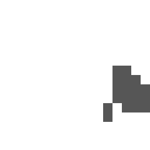

# Right Click Close

   

A simple Fabric mod that closes the current Minecraft menu when you right-click.

## Requirements

- Minecraft 1.21–26.3
- Fabric Loader 0.19.5 or newer
- Java 21 for 1.21.x, Java 25 for 26.x

## Build

```text
gradle build
```

The default build targets Minecraft 26.1–26.3. To build a jar Minecraft 1.21.x release, use:

```text
cp build-legacy.gradle build.gradle && gradle build -Pminecraft_version=1.21.11 -Pyarn_mappings=1.21.11+build.6
```

The built file is in `build/libs/`.

## Install

1. Install Fabric Loader for your Minecraft version.
2. Copy the built jar into the `mods` folder.
3. Start Minecraft.
